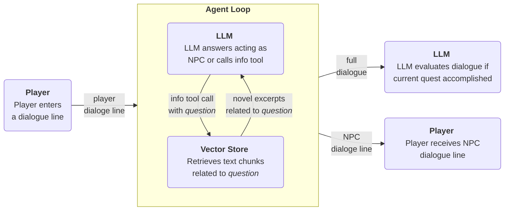

# wonderland
An AI game based on the novel Alice in Wonderland

```mermaid
flowchart LR
    P1("`**Player** <br> Player enters <br> a dialogue line`")
    subgraph a ["`**Agent Loop**`"]
    direction TB
    L1("`**LLM** <br> LLM answers acting as NPC or calls info tool`")
    R("`**Vector Store** <br> Retrieves text chunks related to *question*`")
    end
    L2("`**LLM** <br> LLM evaluates dialogue if current quest accomplished`")
    P2("`**Player** <br> Player receives NPC dialogue line`")
    P1 -->|"`player <br> dialoge line`"| a
    a -->|"`full <br> dialogue`"| L2
    L1 -->|"`info tool call <br> with *question*`"| R
    R -->|"`novel excerpts <br> related to *question*`"| L1
    a -->|"`NPC <br> dialoge line`"| P2
```
 
pnpm run dev
uv run fastapi de<v src/local_main.py 