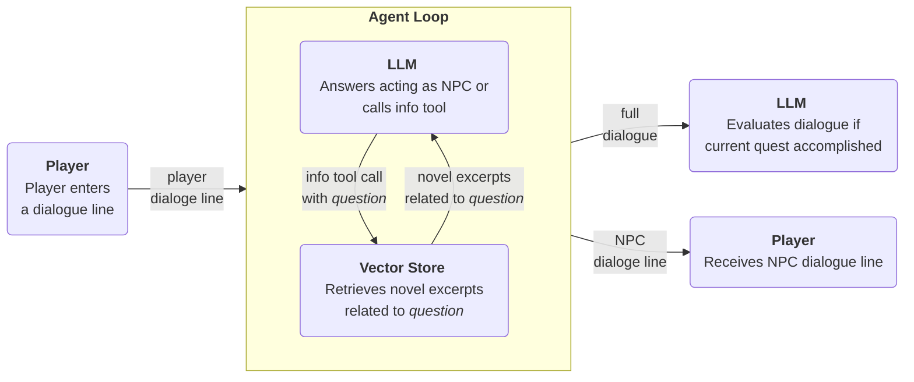

# AI Wonderland

An AI-powered adventure game inspired by Lewis Carroll's *Alice's Adventures in Wonderland*. 
Experience an interactive story where AI brings the whimsical world of Wonderland to life 
through dynamic conversations, image generation, and adaptive storytelling.

## How it works

1.  **Start:** When you start a new game, an LLM generates a series of dynamic quests for your session.
2.  **Talking with NPCs:** An AI agent, acting as each NPC, responds to your dialogue.
3.  **Travel:** A text-to-text model describes your destination and a text-to-image model brings it to life.

The core of the game is the AI agent that powers the NPCs. 
Here's a flowchart illustrating how the agent processes player interactions:



For a deeper dive into the agent architecture and game mechanics, check out my 
[Medium article](https://medium.com/@joern.kalz/using-ai-to-create-an-adventure-game-on-the-fly-f9c60767aaa4).

## Development Setup

### Prerequisites

- Install [uv](https://github.com/astral-sh/uv)
- Install [pnpm](https://pnpm.io/)
- Create an API from Groq [here](https://console.groq.com/)
- Create an API from OpenAI [here](https://platform.openai.com/login?next=%2Fsettings%2Forganization%2Fapi-keys)


### Running the Backend

Create a `.env` file in the `backend/app` directory with the following variables:

```env
OPENAI_API_KEY=your_openai_api_key
GROQ_API_KEY=your_groq_api_key
```

Start the FastAPI development server locally

```bash
cd backend/app
uv sync
uv run fastapi dev src/local_main.py
```

### Running the Frontend

Start the Next.js development server

```bash
cd frontend/app
pnpm install
pnpm run dev
```

Open your browser at [http://localhost:3000](http://localhost:3000)

## Deployment to an AWS account

Deploy the game to an AWS account with

- [Steps for backend deployment](backend/infra/README.md)
- [Steps for frontend deployment](frontend/infra/README.md)


## Tech Stack

- **Backend**: RestAPI based on Python / FastAPI / uv. 
  Groq for text generation. 
  OpenAI for image generation. 
  LangChain / FAISS / FastEmbed for similarity search.
- **Frontend**: Single Page Application based on Next.js / TypeScript / pnpm / Tailwind.
- **Infrastructure**: Cloud deployment to AWS Lambda / S3 / CloudFront via CDK.

## License

This project is licensed under the MIT License - see the [LICENSE](LICENSE) file for details.